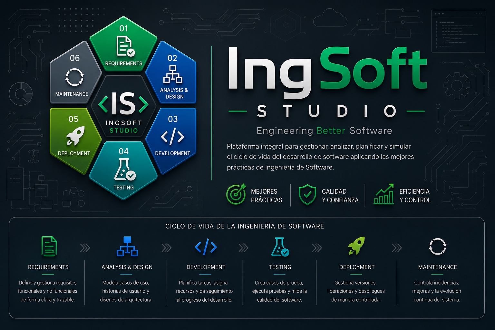

<div align="center">



<br/>


<br/>
<br/>


> Plataforma web para gestionar, analizar y simular el ciclo de vida del desarrollo de software, desde los requisitos y el diseño hasta las pruebas, la calidad y el mantenimiento.

</div>

## 📌 Descripción

**IngSoft Studio** es una plataforma web orientada a la gestión integral de proyectos de software. Centraliza requisitos, análisis, diseño, riesgos, métricas, pruebas, calidad, trazabilidad, mantenimiento y simulación de escenarios dentro de un único espacio de trabajo.

El proyecto nace como una reconstrucción moderna de los contenidos estudiados en **Introducción a la Ingeniería en Software (SOF-015)** del Instituto Tecnológico de Las Américas. La asignatura fue principalmente teórica; esta nueva implementación convierte aquellos fundamentos en una aplicación real, modular y preparada para crecer como proyecto profesional de portafolio.

> 💡 La idea de transformar el trabajo académico en una plataforma de software fue concebida por **Francis Jairo Matías Rosario**.

---

## 🎯 Objetivo general

Desarrollar un entorno profesional que permita planificar, documentar, controlar y evaluar el ciclo de vida de proyectos de software, aplicando principios de Ingeniería de Software, trazabilidad, aseguramiento de calidad, estimación, gestión de riesgos y mejora continua.

---

## 🔄 Ciclo de vida cubierto

| Fase | Alcance dentro de IngSoft Studio |
|---|---|
| 📋 Requisitos | Requisitos funcionales y no funcionales, historias de usuario y priorización |
| 📐 Análisis y diseño | Casos de uso, arquitectura, componentes y decisiones técnicas |
| 💻 Desarrollo | Planificación, tareas, estados y seguimiento del progreso |
| 🧪 Pruebas | Casos de prueba, ejecuciones, evidencias, defectos y cobertura |
| 🚀 Despliegue | Versiones, entregas, liberaciones y control de cambios |
| 🔄 Mantenimiento | Incidencias, solicitudes de mejora y evolución continua |

---

## 🚀 Funcionalidades previstas

- 📊 Dashboard ejecutivo
- 📁 Gestión de proyectos
- 👥 Usuarios, roles y permisos
- 📋 Ingeniería de requisitos
- 🧭 Historias de usuario y casos de uso
- 🏗️ Análisis y diseño de arquitectura
- ⚠️ Gestión de riesgos
- 📐 Métricas y estimaciones
- 🧪 Gestión de pruebas y defectos
- 🔗 Matriz de trazabilidad
- ✅ Revisiones y aseguramiento de calidad
- 📄 Reportes PDF y Excel
- 🎮 Simulador de decisiones de Ingeniería de Software
- 🎓 Centro de aprendizaje
- 🔔 Notificaciones y seguimiento

---

## 🛠️ Stack tecnológico

### Backend

<p>
  
  
</p>

- C#
- .NET 10
- ASP.NET Core Web API
- Entity Framework Core
- SQL Server LocalDB / SQL Server Express
- Swagger / OpenAPI
- Serilog
- FluentValidation
- Mapster

### Frontend

<p>
  
</p>

- React 19
- TypeScript
- Vite
- React Router
- TanStack Query
- Tailwind CSS
- React Hook Form
- Zod
- Recharts
- React Flow
- Lucide React

### Base de datos

<p>
  
</p>

- Microsoft SQL Server
- Entity Framework Core Migrations
- LocalDB para desarrollo local

### Calidad y automatización

<p>
  
</p>

- xUnit
- FluentAssertions
- NSubstitute
- Vitest
- React Testing Library
- Playwright
- GitHub Actions

---

## 🏗️ Arquitectura

IngSoft Studio utiliza una **Clean Architecture pragmática** organizada como **monolito modular**. Esta decisión mantiene una separación clara de responsabilidades sin introducir la complejidad prematura de microservicios.

```text
IngSoft-Studio/
├── backend/
│   └── src/
│       ├── IngSoftStudio.Domain/
│       ├── IngSoftStudio.Application/
│       ├── IngSoftStudio.Infrastructure/
│       └── IngSoftStudio.Api/
├── frontend/
│   └── ingsoft-studio-web/
├── docs/
├── .github/workflows/
└── README.md
```

Regla de dependencias:

```text
Domain ← Application ← Infrastructure ← API
```

- **Domain:** entidades, reglas de negocio y enumeraciones.
- **Application:** casos de uso, DTO, contratos y validaciones.
- **Infrastructure:** persistencia, EF Core, SQL Server y servicios técnicos.
- **API:** endpoints, middleware, configuración y documentación OpenAPI.
- **Frontend:** interfaz React modular y desacoplada de la implementación interna del backend.

---

## 🧱 Principios de desarrollo

- Clean Code
- SOLID
- DRY
- KISS
- Separación de responsabilidades
- Arquitectura modular
- Seguridad por diseño
- Código mantenible y escalable
- Validación centralizada
- Documentación orientada al valor

---

## 🎓 Contexto académico

| Dato | Información |
|---|---|
| 🏫 Institución | Instituto Tecnológico de Las Américas (ITLA) |
| 📖 Asignatura | Introducción a la Ingeniería en Software |
| 🆔 Código | SOF-015 |
| 👨‍🏫 Profesor | Leandro Eduardo Fondeur Gil |
| 📅 Período académico | 2017-C3 |
| 👥 Grupo | #4 |
| 📚 Naturaleza de la materia | Teórica |
| 💡 Idea de reconstrucción | Francis Jairo Matías Rosario |

---

## 👥 Integrantes del grupo original

| Nombre completo | Matrícula |
|---|---|
| 👨‍💻 **Francis Jairo Matías Rosario** | 2015-2984 |
| 👨‍🎓 **Franger Omar Ramírez Peguero** | 2015-3008 |
| 👨‍🎓 **Pedro Arturo de León Parra** | 2015-3018 |
| 👨‍🎓 **José Andres Durán Diaz** | 2015-3035 |
| 👨‍🎓 **Fidel Ernesto Acosta Morillo** | 2015-3045 |

> El grupo participó en los trabajos académicos originales. La reconstrucción moderna de IngSoft Studio corresponde a una iniciativa posterior desarrollada por Francis Jairo Matías Rosario.

### Reencuentro académico

**Pedro Arturo de León Parra** también formó parte del grupo de **Auditoría Informática (SOF-009)** que posteriormente inspiró el proyecto [AuditCore](https://github.com/Jairo0811/AuditCore). IngSoft Studio representa, por tanto, un nuevo capítulo de colaboración académica entre compañeros que ya habían compartido otra asignatura del ITLA.

---

## 📦 Estado actual

El proyecto se encuentra en **fase de fundación técnica**. Ya existe una primera base full stack, pero todavía no constituye una versión funcional completa del producto.

| Área | Estado | Detalle |
|---|---|---|
| Backend ASP.NET Core | ✅ Base creada | Proyectos Domain, Application, Infrastructure y API |
| Frontend React | ✅ Base creada | Dashboard inicial con React, TypeScript y Vite |
| Arquitectura modular | ✅ Configurada | Separación de capas y responsabilidades |
| Primer módulo de proyectos | 🟡 Inicial | Entidad, servicio y endpoints básicos |
| SQL Server | 🟡 Configurado | LocalDB preparado; migraciones funcionales pendientes |
| Swagger / OpenAPI | ✅ Configurado | Documentación inicial de endpoints |
| GitHub Actions | 🟡 Parcial | Frontend compila; backend requiere actualizar dependencias vulnerables |
| Autenticación | 🚧 Pendiente | Usuarios, roles y permisos |
| Pruebas automatizadas | 🚧 Pendiente | Suites backend y frontend |
| Módulos funcionales | 🚧 Pendiente | Requisitos, riesgos, calidad, testing y simulación |

> ⚠️ El workflow actual detectó vulnerabilidades en dependencias del backend. Estas dependencias deben actualizarse antes de continuar con nuevas funcionalidades.

---

## 🗺️ Roadmap

### Fase 1 — Fundación técnica

- [x] Arquitectura backend
- [x] Proyecto frontend
- [x] Dashboard inicial
- [x] Primer módulo de proyectos
- [x] Swagger / OpenAPI
- [x] GitHub Actions
- [ ] Actualizar dependencias vulnerables
- [ ] Compilación completa del backend en CI
- [ ] Migración inicial de SQL Server
- [ ] Pruebas base

### Fase 2 — Identidad y acceso

- [ ] Registro e inicio de sesión
- [ ] Roles y permisos
- [ ] Recuperación de contraseña
- [ ] Perfil de usuario

### Fase 3 — Proyectos y requisitos

- [ ] Gestión completa de proyectos
- [ ] Requisitos funcionales y no funcionales
- [ ] Historias de usuario
- [ ] Casos de uso
- [ ] Priorización MoSCoW

### Fase 4 — Calidad y pruebas

- [ ] Riesgos
- [ ] Métricas
- [ ] Casos de prueba
- [ ] Defectos
- [ ] Evidencias
- [ ] Matriz de trazabilidad

### Fase 5 — Simulación y reportes

- [ ] Simulador de decisiones
- [ ] Dashboard conectado a datos reales
- [ ] Reportes PDF y Excel
- [ ] Centro de aprendizaje

---

## ▶️ Ejecución local

### Requisitos

- .NET 10 SDK
- Node.js LTS
- SQL Server LocalDB o SQL Server Express
- Git

### Backend

```powershell
cd backend/src/IngSoftStudio.Api
dotnet restore
dotnet run
```

### Frontend

```powershell
cd frontend/ingsoft-studio-web
npm install
npm run dev
```

---

## 📚 Proyecto relacionado

- [AuditCore](https://github.com/Jairo0811/AuditCore) — plataforma de gestión de auditorías de TI inspirada en la asignatura Auditoría Informática (SOF-009).

Ambos proyectos convierten materias teóricas del ITLA en aplicaciones web profesionales, preservando su contexto académico y evolucionándolo hacia soluciones modernas de portafolio.

---

## 📄 Licencia

Licencia pendiente de definición.

---

<div align="center">

### IngSoft Studio

**Planifica. Diseña. Construye. Mejora.**

Desarrollado como reconstrucción moderna de una experiencia académica del ITLA.

</div>
