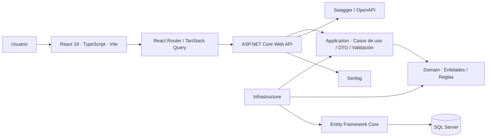
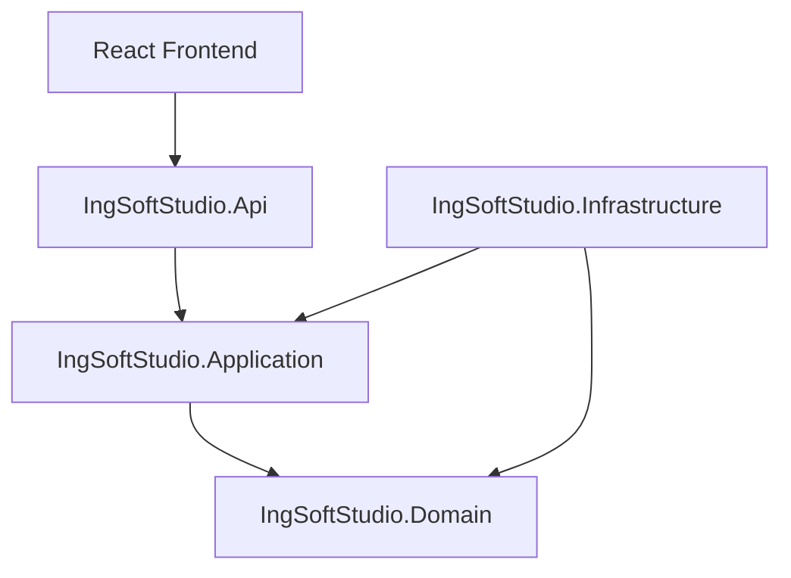
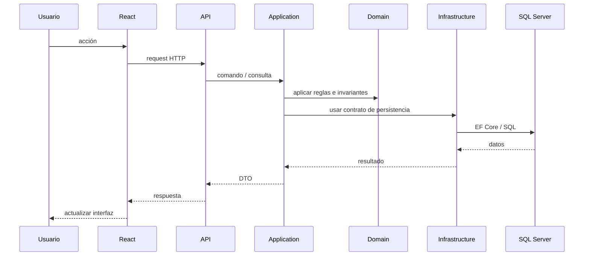
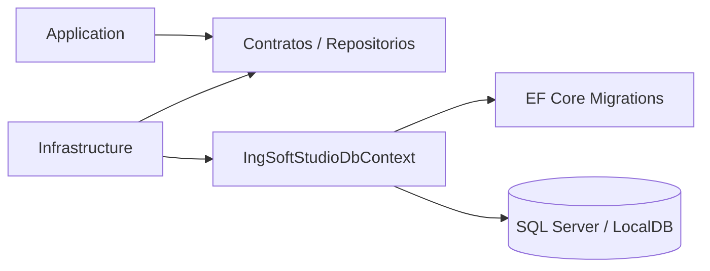
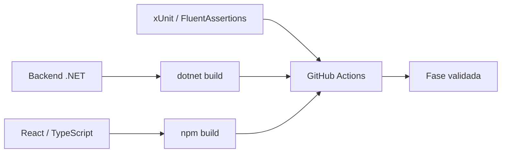

# Arquitectura de IngSoft Studio

IngSoft Studio utiliza una **Clean Architecture pragmática** organizada como **monolito modular full stack**. La Fase 1 establece los límites fundamentales entre dominio, casos de uso, infraestructura, API y frontend; los módulos funcionales siguientes deben crecer respetando esas dependencias.

## Vista general



La regla principal es que **Domain no depende de infraestructura ni presentación**. Application define los casos de uso y contratos; Infrastructure implementa persistencia y servicios técnicos; API compone la aplicación; React consume únicamente contratos HTTP.

## Regla de dependencias



```text
Domain ← Application ← Infrastructure ← API
```

La representación textual resume la dirección conceptual; Infrastructure implementa contratos definidos hacia dentro y API actúa como composition root.

## Ensamblados

| Proyecto | Responsabilidad |
|---|---|
| `IngSoftStudio.Domain` | Entidades, invariantes, enumeraciones y reglas de negocio |
| `IngSoftStudio.Application` | Casos de uso, DTO, contratos, validación y mapeo |
| `IngSoftStudio.Infrastructure` | EF Core, SQL Server, repositorios y servicios técnicos |
| `IngSoftStudio.Api` | Endpoints, middleware, composición, OpenAPI y configuración |
| `ingsoft-studio-web` | Experiencia React, rutas, componentes y consumo de API |

## Módulos funcionales previstos

```mermaid
flowchart TB
    Platform["IngSoft Studio"]
    Platform --> Identity["Identidad / Roles / Permisos"]
    Platform --> Projects["Proyectos"]
    Platform --> Requirements["Requisitos / Historias / Casos de uso"]
    Platform --> Design["Análisis / Diseño / Arquitectura"]
    Platform --> Risks["Riesgos / Estimaciones"]
    Platform --> Testing["Pruebas / Defectos / Evidencias"]
    Platform --> Traceability["Trazabilidad"]
    Platform --> Quality["Calidad / Revisiones"]
    Platform --> Releases["Versiones / Despliegue / Mantenimiento"]
    Platform --> Simulation["Simulador de decisiones"]
    Platform --> Learning["Centro de aprendizaje"]
    Platform --> Reporting["Dashboard / PDF / Excel"]
```



Los módulos posteriores deben incorporarse como capacidades verticales sin romper la regla de dependencias ni convertir la API en un contenedor de lógica de negocio.

## Flujo de una operación



## Persistencia



Entity Framework Core y SQL Server pertenecen a Infrastructure. Domain no debe referenciar `DbContext`, migraciones ni detalles de almacenamiento.

## Estado actual de la arquitectura

La **Fase 1 — Fundación técnica** ya dispone de:

- proyectos Domain, Application, Infrastructure y API;
- frontend React + TypeScript + Vite;
- primer módulo básico de proyectos;
- `DbContext` y migración inicial para SQL Server;
- Swagger/OpenAPI;
- logging con Serilog;
- pruebas de dominio;
- pipeline de GitHub Actions para backend y frontend.

La autenticación y la mayoría de módulos de negocio pertenecen a fases posteriores y no deben considerarse implementados por el mero hecho de aparecer en el diagrama de evolución.

## Calidad y CI



## Criterio de evolución

IngSoft Studio debe continuar como monolito modular mientras los módulos compartan el mismo contexto transaccional y equipo. La prioridad es reforzar límites internos, pruebas y contratos; microservicios no aportan valor en la etapa actual.
